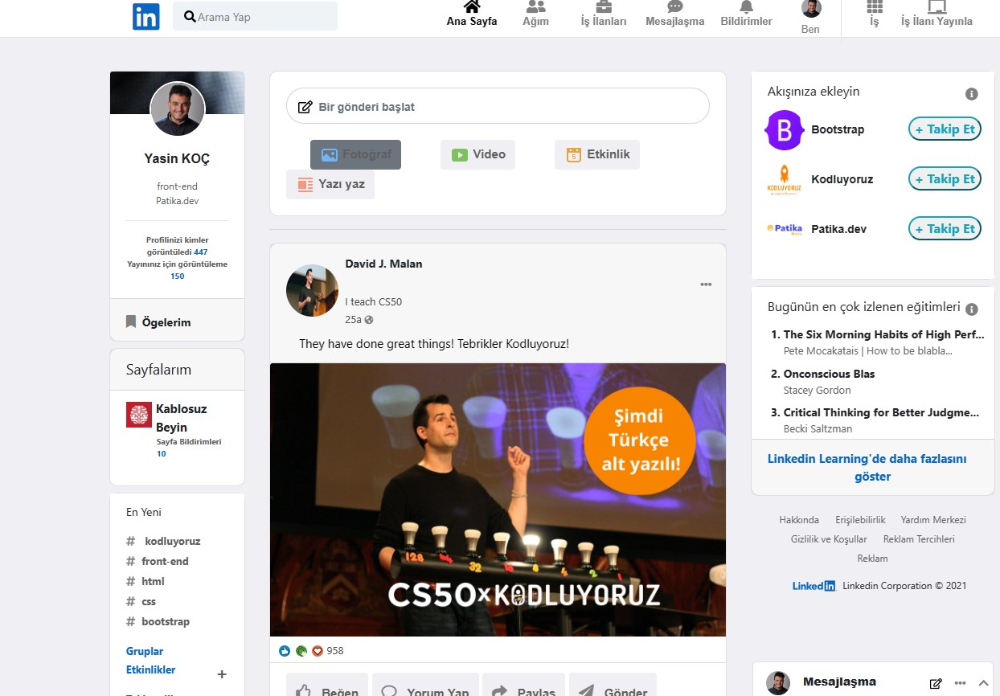

# linkedinclone-with-bootstrap

Home Work CSS patika.dev

This repo is 'Linkedin Clone Work with Bootstrap' which is part of the Beginner Frontend Web Development Trail. README.md contains index.html files and css, assets folders.

Click to visit profile Patika

https://app.patika.dev/ysnkoc

Click to visit profile GitHub

https://github.com/YasinK0C

'